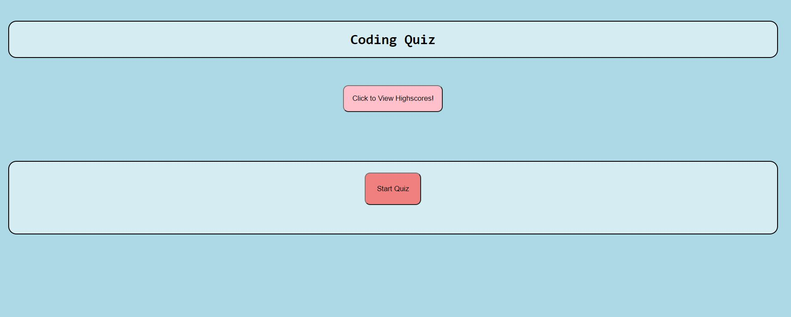
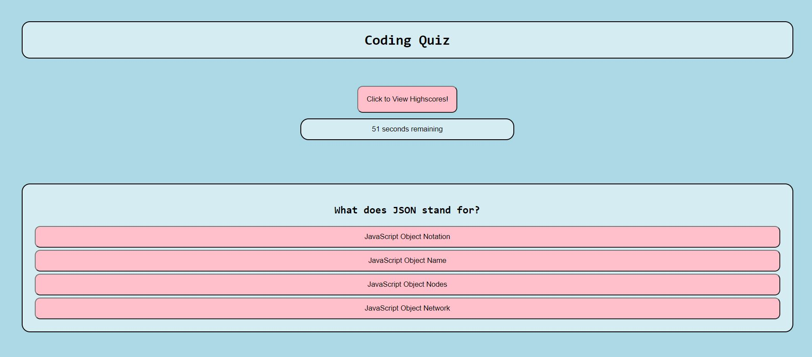
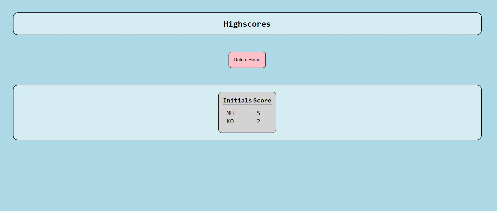

# CodeQuiz

## Description

This project was created so a user can take a quiz with 5 different coding questions that is timed and saves highscores. This was created using JavaScript, HTML, and CSS. The user is timed for 60 seconds, and if they got the question correct or incorrect, it is displayed on the screen. If they answer incorrectly, 5 seconds is subtracted from the timer. The high scores are displayed at the end of the quiz. They can also look at highscores before the quiz begins by clicking a button to navigate them to a different page. 

While creating this application, I learned a lot about JavaScript and how it uses the DOM to maniuplate elements on the application. I also learned how to use a timer on an application, add Event Listeners, use for loops, use JSON to stringify and parse data to and from local storage, and add classes to elements in JavaScript.

## Installation

Click the github URL link to view the website. To view the code, click the link to the github repository. Download the repository to your computer and unzip the file. Open the index.html file to view the HTML code. Open the style.css file to view the style sheet. Open the script.js file to view the JavaScript code. 

## Usage

When the user clicks the link to deploy the website, they are brought to this main page of the code quiz:

Once the code quiz starts, this screen is shown. There is a timer that counts down from 60 seconds and 5 seconds get taken off of the clock if the user answers incorrectly. "Correct" and "Incorrect" are displayed on the screen depending on if they answered the question right.

When the time runs out, or if the user answers all of the questions, the quiz ends and is taken to the high score page. The highscore page is saved into local storage, so they are saved after each time the user reloads the page. There is also a separate highscore page that the user can navigate to before the quiz starts if they wish to see old highscores without playing the game.

## Credits

T.A. Brian Ford
Peers from class: Sabriel Gee, Scott Nichols

## License
MIT License

Copyright (c) 2021 Mikayla Howitz

Permission is hereby granted, free of charge, to any person obtaining a copy of this software and associated documentation files (the "Software"), to deal in the Software without restriction, including without limitation the rights to use, copy, modify, merge, publish, distribute, sublicense, and/or sell copies of the Software, and to permit persons to whom the Software is furnished to do so, subject to the following conditions:

The above copyright notice and this permission notice shall be included in all copies or substantial portions of the Software.

THE SOFTWARE IS PROVIDED "AS IS", WITHOUT WARRANTY OF ANY KIND, EXPRESS OR IMPLIED, INCLUDING BUT NOT LIMITED TO THE WARRANTIES OF MERCHANTABILITY, FITNESS FOR A PARTICULAR PURPOSE AND NONINFRINGEMENT. IN NO EVENT SHALL THE AUTHORS OR COPYRIGHT HOLDERS BE LIABLE FOR ANY CLAIM, DAMAGES OR OTHER LIABILITY, WHETHER IN AN ACTION OF CONTRACT, TORT OR OTHERWISE, ARISING FROM, OUT OF OR IN CONNECTION WITH THE SOFTWARE OR THE USE OR OTHER DEALINGS IN THE SOFTWARE.
